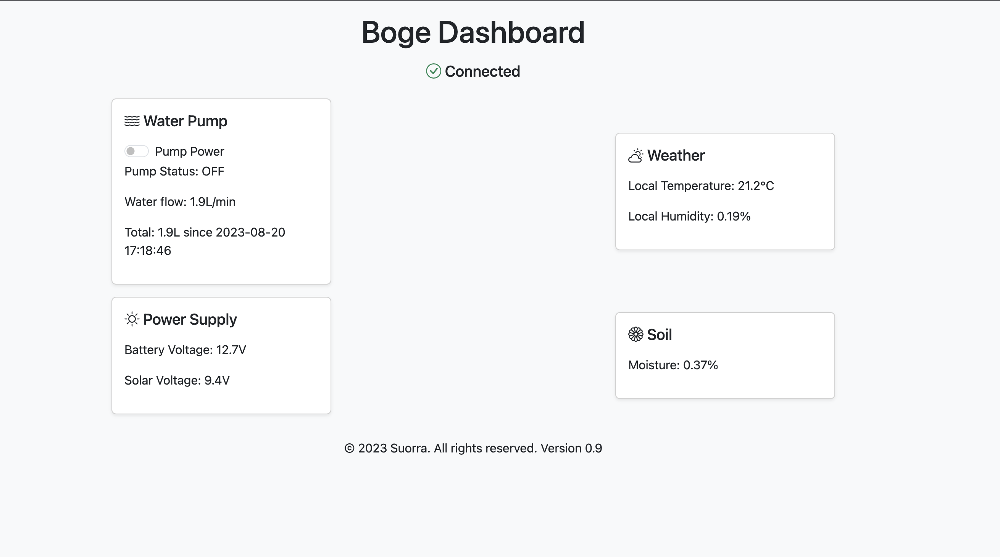
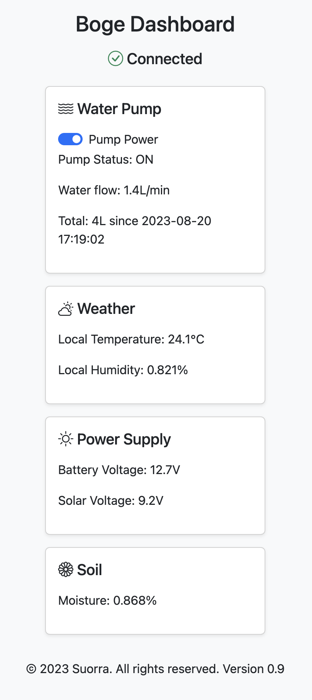

# Boge

Raspberry Pi Hardware project of Autumn 2023!

## Idea

- Be able to switch a 12V waterpump
- Read voltage of the 12V battery the pump + rpi is connected to
- Read if relay is on or not
- Read air humidity + temp
- Read soil moisture

Everything be remotly accessible 

## Todo

Phase 1

- [X] Update backend to return all sensor values
- [X] Update HTML to pull backend for values every second
- [X] Move to docker container
- [X] Create docker-compose with backend + nginx with basic auth & ssl
- [X] Add some nice CSS

Phase 2

- [X] Start testing 4G modem

~~- Setup so RPi connects to dyndns service on boot~~

- Setup ssh tunnle on boot to sshserver

ssh-server:
- install:
    - nginx
    - certbot

- setup cert:
    
    `sudo certbot certonly --standalone -d example.com -d www.example.com`

    Stored here:
    - /etc/letsencrypt/live/<domain>/fullchain.pem
    - /etc/letsencrypt/live/<domain>/privkey.pem


## Wiring

Can be found [here](./wiring.md)

## Preview





## Connect ssh

1. ssh into bastion host on @sshserver.local

2. From that, ssh via tunnel on @localhost -p <port>

## Home assistant setup

configuration.yaml needs this:

```
http:
  use_x_forwarded_for: true
  trusted_proxies:
    - 127.0.0.1
    - ::1
```

## mqtt

Create password for user:

1. exec into mqtt container

2. run

    ```bash
    mosquitto_passwd -c /mosquitto/config/password.txt sensors
    ```
