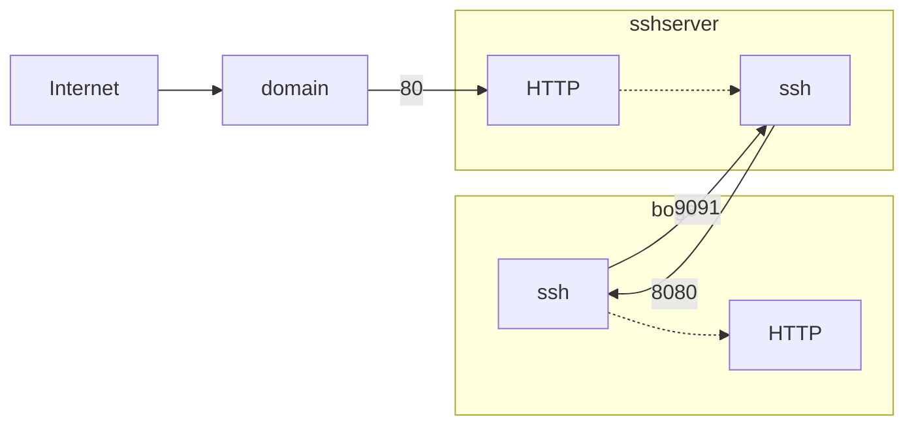

# SSD Connection

This flowchart shows how the SSH connections are being made




## From Boge

During boot, Boge does the following:

1. Check if we can resolve the domain
2. Once the domain is resolved, we know we have internet, continue
3. Connect to domain on port defined in router, map that to 9091 on target

## From SSH Server

During boot, the SSH Server does the following:

1. Connect to localhost on port 9091, map connection from port 80 to port 8080

## Check service status:

**Boge:**

```sh
systemctl status ssh_reverse_proxy.service
````

**SSH Server:**

proxy tunnle
```sh
systemctl status proxy_tunnle.service
````

nginx
```sh
systemctl status nginx
````