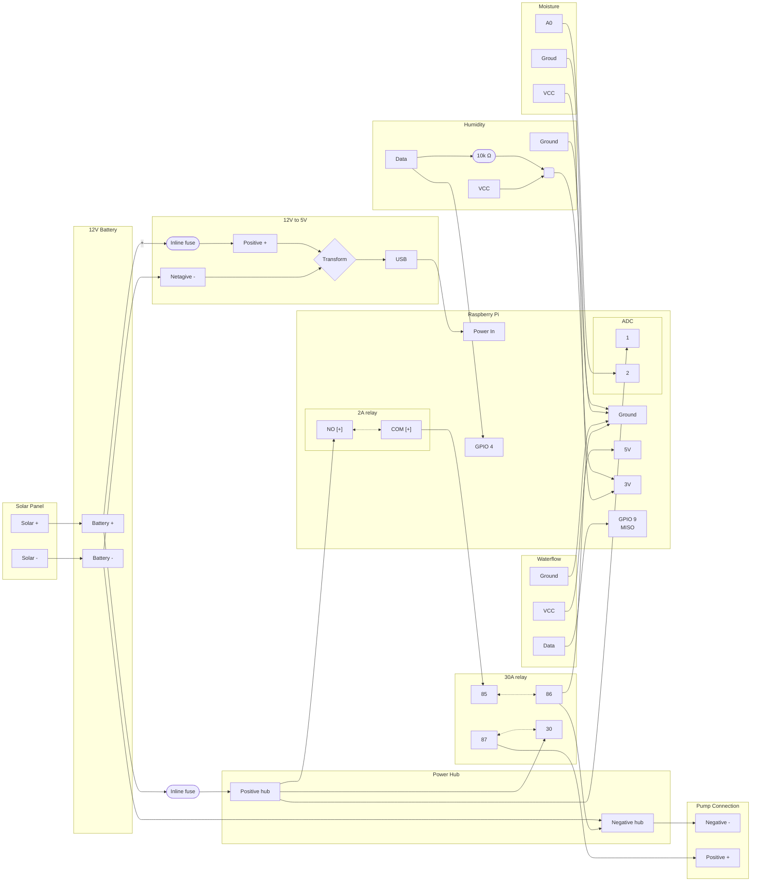

# The wiring of the hardware

```mermaid
flowchart LR

    subgraph "Solar Panel"
        SP[Solar +]
        SN[Solar -]
    end

    subgraph "12V Battery"
        BP[Battery +]
        BN[Battery -]
    end

    %% Connect solar to battery
    SP --> BP
    SN --> BN

    subgraph "Power Hub"
        PHP[Positive hub]
        PHN[Negative hub]
    end

    %% Connect Battery to power hub
    %% via an inline fuse
    BP --> IF1([Inline fuse])
    IF1 --> PHP
    BN --> PHN

    subgraph "12V to 5V"
        TransP[Positive +]
        TransN[Netagive -]
        USB[USB]

        BP --> |+| IF2([Inline fuse])
        IF2 --> TransP
        BN --> TransN

        TransP --> T{Transform}
        TransN --> T

        T --> USB
    end

    subgraph "30A relay"
        SW1[85]
        SW2[86]
        
        LD1[87]
        LD2[30]

        SW1 <-.-> SW2
        LD1 <-.-> LD2
    end


    subgraph "Raspberry Pi"
        RPI["Power In"]
        GRPI["Ground"]
        V5["5V"]
        V3["3V"]
        GPIO4["GPIO 4"]
        GPIO9["GPIO 9<br>MISO"]

         subgraph "ADC"
            %% Analog to digitacl converter
            %% Input 1 used to measure battery
            %% Input 2 used to measure
            ADC1[1]
            ADC2[2]
        end

        subgraph "2A relay"
            NO["NO [+]"]
            COM["COM [+]"]

            NO <-.-> COM
            COM --> SW1
        end
    end

    subgraph "Humidity"
        HUM1["VCC"]
        HUM2["Data"]
        HUM4["Ground"]
        RES10k(["10k Ω"])
        HUMC(" ")

        HUM2 --> GPIO4
        HUM2 --> RES10k
        RES10k --> HUMC
        HUM1 --> HUMC
        HUMC --> V3
        HUM4 --> GRPI
    end

    

    subgraph "Moisture"
        MOIVCC["VCC"]
        MOIG["Groud"]
        MOIA0["A0"]

        MOIVCC --> V3
        MOIG --> GRPI
        MOIA0 --> ADC2
    end

    subgraph "Waterflow"
        WATP["VCC"]
        WATG["Ground"]
        WATD["Data"]

        WATP --> V5
        WATG --> GRPI
        WATD --> GPIO9
    end

    %% USB powers the RPi
    USB --> RPI

    %% Measure the battery in ADC1
    PHP --> ADC1

    %% Battery positive goes to load 2 in big relay
    PHP --> LD2

    %% Battery positive goes to NO on small relay
    PHP --> NO

    %% Join all grounds
    SW2 --> GRPI
    SW2 --> PHN

    subgraph "Pump Connection"
        PUMPN[Negative -]
        PUMPP[Positive +]
    end

    PHN --> PUMPN
    LD1 --> PUMPP
```